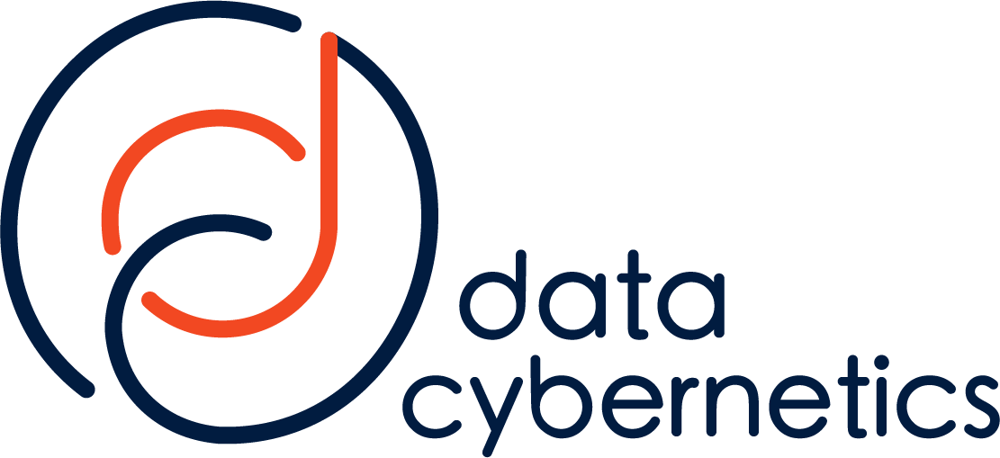

# HypermediaUI

This is a Web UI to generically process Siren speaking http servers.
Note that it is developed to access APIs which use the [Siren Hypermedia Format](https://github.com/kevinswiber/siren).

This Client is designed to work with the [RESTyard project](https://github.com/RESTyard/RESTyard).
Use the demo server "CarShack" from this project to have a quick compliant backend.

There are some minor deviations from the Siren hypermedia format. [See the RESTyard documentation](https://restyard.github.io/RESTyard-Docs/content/12-Notes-on-Siren.html)

**NOTE**
The code was originally developed [here](https://github.com/MathiasReichardt/HypermediaUi) but was now moved to the RESTyard organization.

## Local Development

Run `ng serve` for a dev server. Navigate to `http://localhost:4200/`. The application will automatically reload if you change any of the source files.

Run `ng build` to build the project. The build artifacts will be stored in the `dist/` directory.

## 💚 Many thanks to our dear sponsors

  
 
    
  

  
 
    
  

